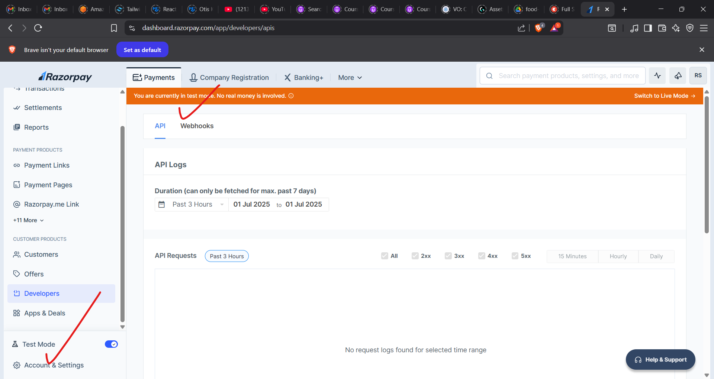
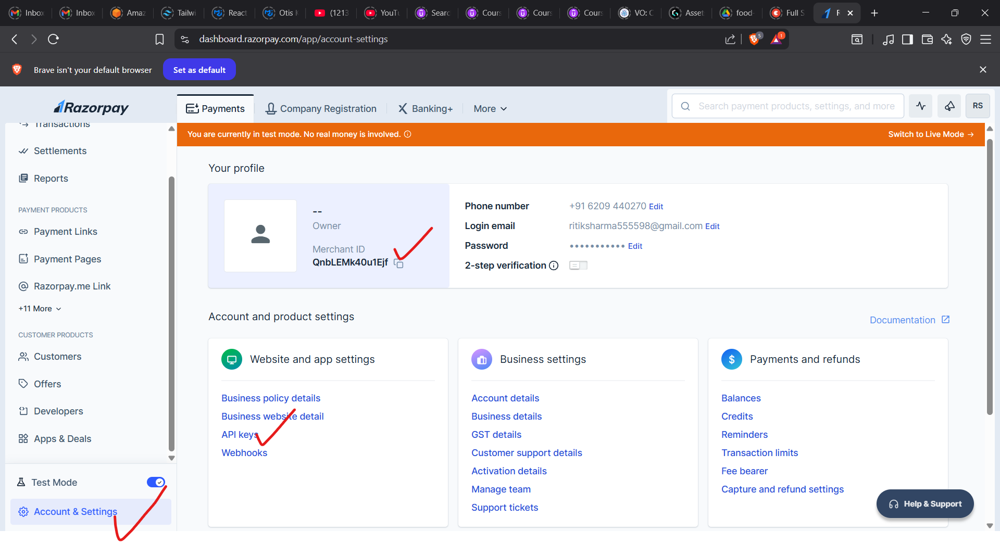
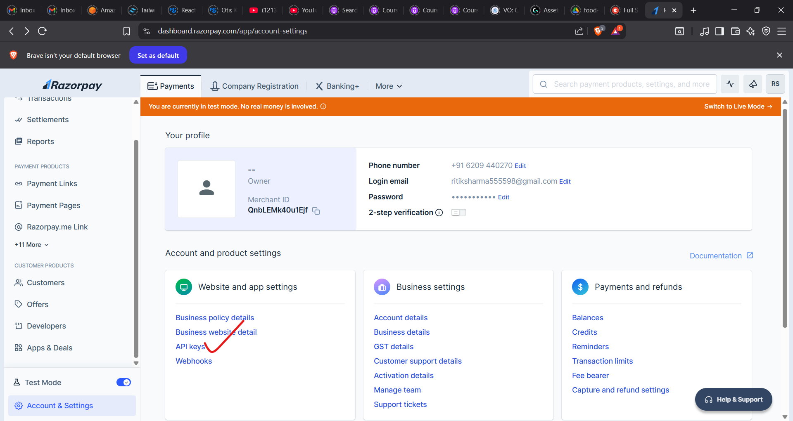
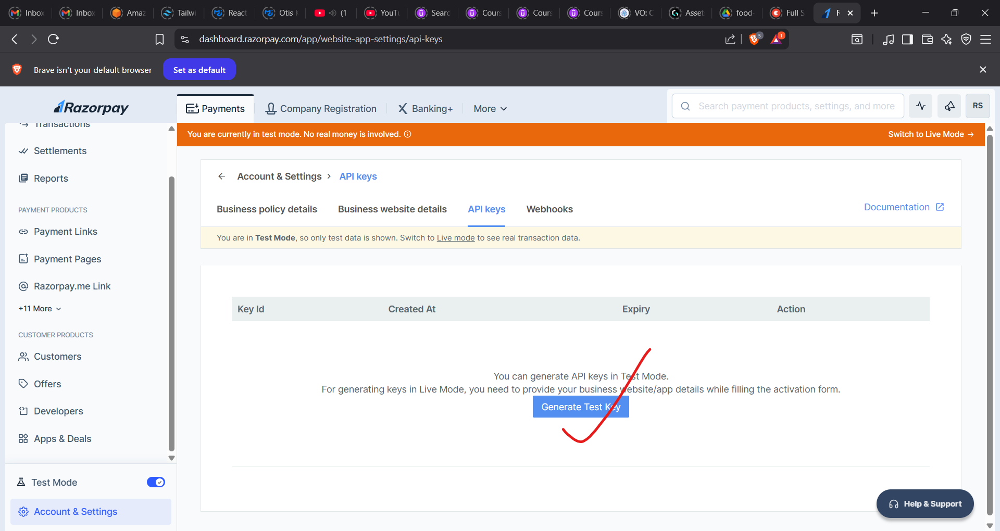
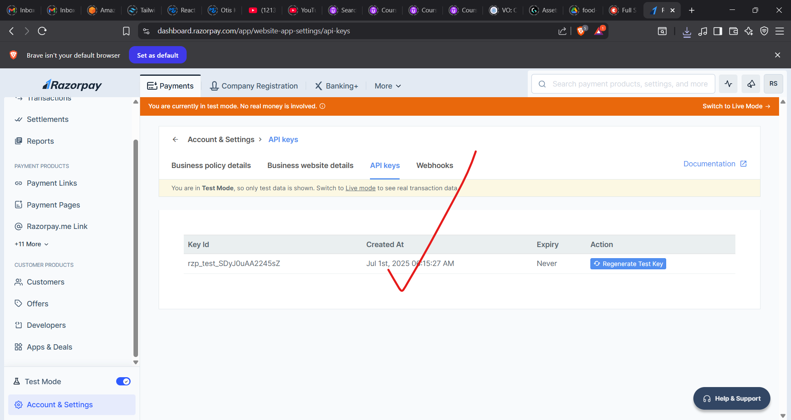
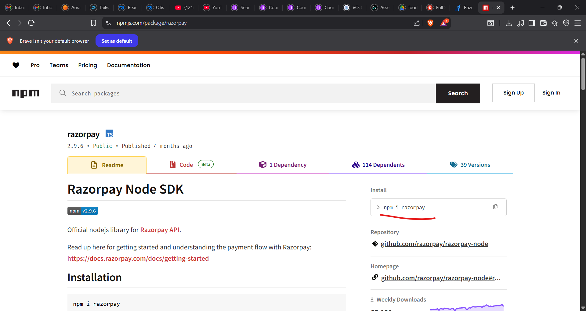

To install the listed dependencies for your Node.js application, follow these steps:

---

### ✅ 1. **Open your terminal**

Navigate to your project directory where your `package.json` file is located.

---

### ✅ 2. **Run this `npm install` command**

```bash
npm install bcrypt@^5.1.0 cors@^2.8.5 dotenv@^16.3.1 express@^4.18.2 jsonwebtoken@^9.0.1 mongoose@^7.3.2 nodemon@^3.0.1 razorpay@^2.9.1 swagger-jsdoc@^6.2.8 swagger-ui-express@^5.0.0
```

---

### 📝 Notes:

* This will install all the required packages as per the versions you listed.
* After installing, your `package.json` file should reflect these versions under `dependencies`.
* You can add `"type": "module"` in `package.json` if you're using ES Modules (with `import`/`export` syntax).

---

### ✅ 3. **Start your server (if applicable)**

For development with `nodemon`, use:

```bash
npx nodemon your-entry-file.js
```

Replace `your-entry-file.js` with your actual entry file, e.g., `index.js`, `server.js`, or `app.js`.

---

## connect with database
1) 
2) 
3) 
4) 
5) 
6) id:ritiksharma555598 pass:ritiksharma555598
7) 
8) 
9) 
10) 
11) 

12) module=>service=>controller=>route=>access end point
13) 
14) 
15) 

## branch_2_creating_the_controller
1) created the adminOrder.controller.js
2) cart.controller.js
3) created the cartItem.controller.js
4) created the order.controller.js
5) created the product.controller.js
6) created the rating.controller.js
7) created the review.controller.js
8) created the middle ware:authenticat.js

## branch_3_creating_routes
1) created adminOrder.routes.js
2) created cartItem.routes.js
3) created cartItem.routes.js
4) created order.routes.js
5) created product.admin.routes.js
6) created rating.routes.js
7) created rating.routes.js
8) 
## branch_4_testing_Postmain 
1) sign-up a user: http://localhost:5454/auth/signin
2) sing-in a user: http://localhost:5454/auth/signin
3) profile: http://localhost:5454/api/users/profile
4) create-a product: http://localhost:5454/api/admin/products/ => after that get the id of 5) get product (_id: 68574d2cb73ca0883311c705)
6) get a cart: http://localhost:5454/api/cart/
7) add-item-to-cart: http://localhost:5454/api/cart/add
8) get a cart: http://localhost:5454/api/cart/
9) create a order:http://localhost:5454/api/orders/
10) remove a cart Item: (for that we need to pass the _id of cartItems which is avaialbe in the cart details for that we need to get the cart in that cartItems will be there from there copy the _id and hit it in the remove cart item url): http://localhost:5454/api/cart_items/68574dbbb73ca0883311c714

11) update cartItem: http://localhost:5454/api/cart_items/68575c5ee5a7b190be909599

12) find-product-by-id: http://localhost:5454/api/products/id/68574d2cb73ca0883311c705

13) get-all-product: http://localhost:5454/api/products?color=white
## ---- branch-5-payment-gateway-implement----
1) 
2) 
2) 
4) 
5) 
6) 
7) then create a config file for razer pay
8) payment.service.js created
9) --- payment.service.js page details ---

Here’s a clear, structured **explanation and breakdown** of your `payment.controller.js` file that interacts with **Razorpay** and your **order service**:

---

## ✅ **File Responsibility:**

This controller handles:

* Creating a Razorpay **Payment Link** for an order.
* Updating order/payment details after payment completion.

---

## ✅ **Code Breakdown**

### **1. Required Dependencies**

```js
const razorpay = require("../config/razorpayClient");
const orderService = require("../services/order.service.js");
```

* **`razorpayClient`**: Configured Razorpay instance (should be initialized with your Razorpay Key ID & Secret).
* **`orderService`**: Your service to interact with the order database.

---

### **2. `createPaymentLink(orderId)`**

#### **Purpose:**

* Generates a Razorpay **Payment Link** for the given order.
* Pre-fills customer details (name, contact, email).
* Sends SMS & email notifications to the customer.
* Redirects the user to a specific URL after successful payment.

#### **Detailed Flow:**

✅ Fetches the order details from DB using `orderService.findOrderById(orderId)`.

✅ Prepares a `paymentLinkRequest` object containing:

* `amount`: multiplied by 100 (because Razorpay works in paisa).
* `currency`: 'INR'.
* `customer`: name, contact, and email populated from order.
* `notify`: enables SMS & email notifications.
* `reminder_enable`: sends automatic reminders.
* `callback_url`: redirects after successful payment.

✅ Calls Razorpay API:

```js
const paymentLink = await razorpay.paymentLink.create(paymentLinkRequest);
```

✅ Returns:

```js
{
  paymentLinkId: paymentLink.id,
  payment_link_url: paymentLink.short_url
}
```

---

### **3. `updatePaymentInformation(reqData)`**

#### **Purpose:**

* After receiving payment confirmation (likely via callback or webhook), this function:

✅ Fetches order by `orderId`.

✅ Fetches payment details from Razorpay using:

```js
const payment = await razorpay.payments.fetch(paymentId);
```

✅ If payment is **captured**, it:

* Updates `order.paymentDetails` with `paymentId` and status `'COMPLETED'`.
* Sets `order.orderStatus` to `'PLACED'`.
* Saves the order to the database.

✅ Returns:

```js
{ message: 'Your order is placed', success: true }
```

---

## ✅ **Assumptions**

✔ You have a valid **Razorpay client** initialized in `razorpayClient.js`.
✔ `orderService.findOrderById(orderId)` fetches the order with nested `user` details.
✔ Your `order` object supports `.save()` method (likely Mongoose or similar ORM).
✔ The callback URL `http://localhost:5173/payment/${orderId}` is where your frontend listens for payment confirmation.

---

## ✅ **Example: razorpayClient.js (Assumed)**

```js
const Razorpay = require("razorpay");

const razorpay = new Razorpay({
  key_id: process.env.RAZORPAY_KEY_ID,
  key_secret: process.env.RAZORPAY_KEY_SECRET
});

module.exports = razorpay;
```

---

## ✅ **Potential Improvements**

* Sanitize and validate order & payment data before using them.
* Handle more payment statuses (failed, pending, etc.) in `updatePaymentInformation`.
* Consider using **webhooks** for secure payment confirmation instead of relying only on frontend callback.

---

## ✅ **Summary**

Your controller:

✔ Generates secure payment links.
✔ Prefills customer info for better UX.
✔ Updates order status after payment confirmation.

---

**If you want, I can help you with:**

* Writing webhook logic for Razorpay.
* Example of `orderService.findOrderById`.
* Full project structure suggestion.

10) creating a payment controller.js : payment.controller.js
details of it:

Here’s a **detailed explanation and short-commented version** of your **Payment Route Controller**, along with the role of each part.

---

## ✅ **File Responsibility:**

This file exposes two controller functions:

1. **`createPaymentLink`** – Creates a payment link for a given order.
2. **`updatePaymentInformation`** – Updates order/payment status after payment confirmation.

These functions interact with your `paymentService` for business logic.

---

## ✅ **Clean Code with Short Comments**

```js
const paymentService = require("../services/payment.service.js");

// Create a Razorpay Payment Link using order ID from params
const createPaymentLink = async (req, res) => {
  try {
    const paymentLink = await paymentService.createPaymentLink(req.params.id); // Generate link
    return res.status(200).send(paymentLink); // Send link in response
  } catch (error) {
    return res.status(500).send(error.message); // Handle errors
  }
};

// Update order payment status based on query params (usually from callback)
const updatePaymentInformation = async (req, res) => {
  try {
    await paymentService.updatePaymentInformation(req.query); // Update payment info
    return res.status(200).send({ message: "payment information updated", status: true });
  } catch (error) {
    return res.status(500).send(error.message); // Handle errors
  }
};

module.exports = { createPaymentLink, updatePaymentInformation };
```

---

## ✅ **Detailed Breakdown**

### 🔹 `createPaymentLink`

* **Method:** `GET` or `POST` (likely `GET`).
* **Path Example:** `/payment-link/:id`
* **Action:** Calls `paymentService.createPaymentLink()` with the order ID from `req.params.id`.
* **Returns:** Payment link URL and ID to the frontend.

---

### 🔹 `updatePaymentInformation`

* **Method:** Usually `GET` (triggered by Razorpay callback URL).
* **Path Example:** `/update-payment-info`
* **Query Example:**
  `http://localhost:3000/update-payment-info?payment_id=xyz&order_id=abc`
* **Action:** Calls `paymentService.updatePaymentInformation()` with data from `req.query`.
* **Returns:** Success message after updating order/payment status.

---

## ✅ **Assumptions**

✔ `paymentService` contains logic to interact with Razorpay and your database.
✔ You have routes properly defined to call these controller functions.
✔ Razorpay's callback points to your `/update-payment-info` route.

---

## ✅ **Optional Suggestions**

If you want, I can help you with:

* Example of how to define routes for these controllers.
* Full Razorpay callback flow (webhooks included).
* TypeScript version of this controller.

11) creating a router: payment.routes.js
12) define the end-point in index.js
13) 
