To install the listed dependencies for your Node.js application, follow these steps:

---

### ✅ 1. **Open your terminal**

Navigate to your project directory where your `package.json` file is located.

---

### ✅ 2. **Run this `npm install` command**

```bash
npm install bcrypt@^5.1.0 cors@^2.8.5 dotenv@^16.3.1 express@^4.18.2 jsonwebtoken@^9.0.1 mongoose@^7.3.2 nodemon@^3.0.1 razorpay@^2.9.1 swagger-jsdoc@^6.2.8 swagger-ui-express@^5.0.0
```

---

### 📝 Notes:

* This will install all the required packages as per the versions you listed.
* After installing, your `package.json` file should reflect these versions under `dependencies`.
* You can add `"type": "module"` in `package.json` if you're using ES Modules (with `import`/`export` syntax).

---

### ✅ 3. **Start your server (if applicable)**

For development with `nodemon`, use:

```bash
npx nodemon your-entry-file.js
```

Replace `your-entry-file.js` with your actual entry file, e.g., `index.js`, `server.js`, or `app.js`.

---

## connect with database
1) 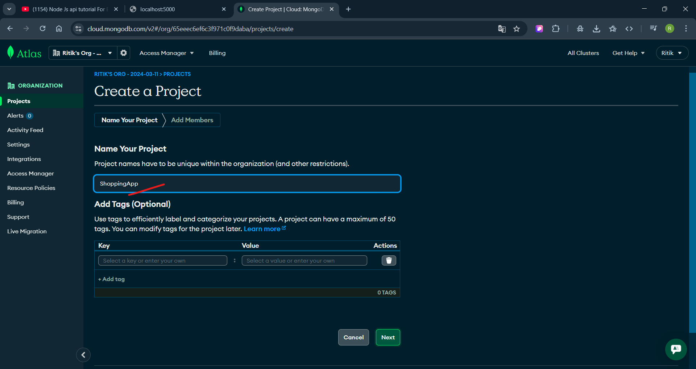
2) 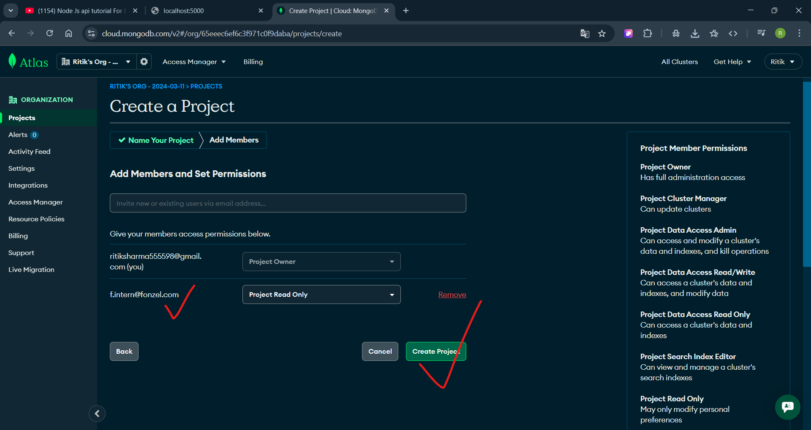
3) 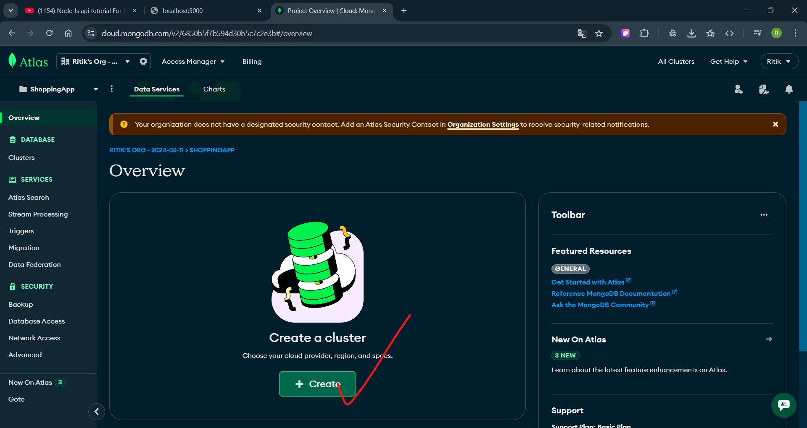
4) 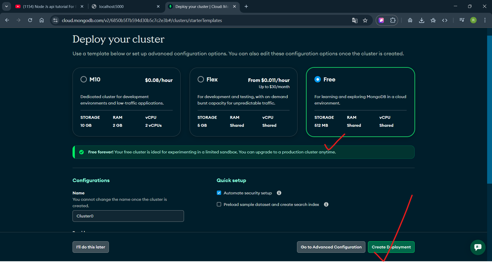
5) 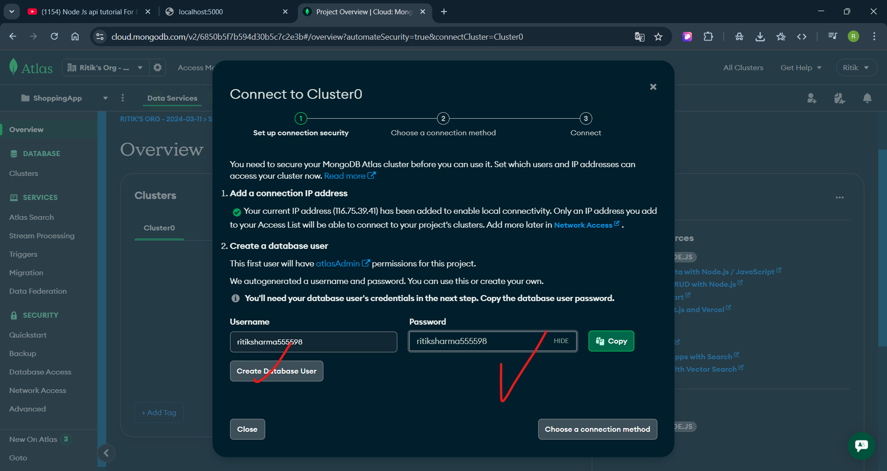
6) id:ritiksharma555598 pass:ritiksharma555598
7) 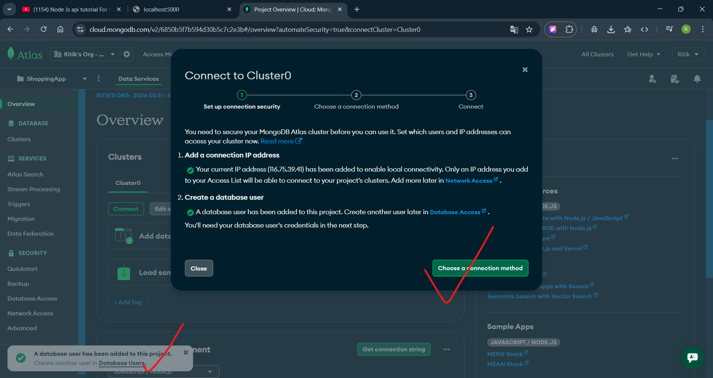
8) 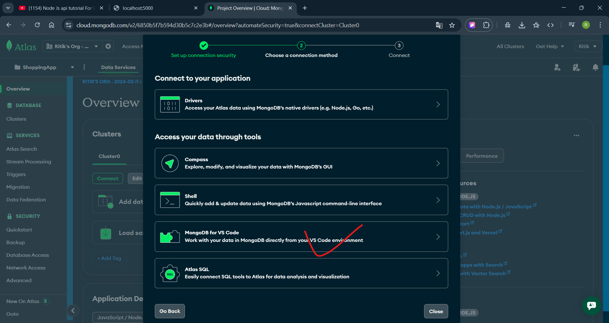
9) 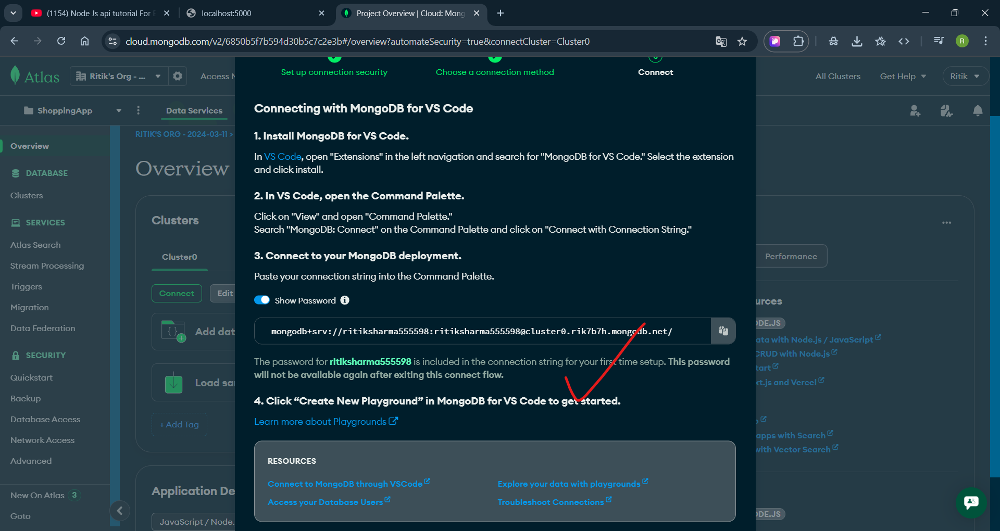
10) 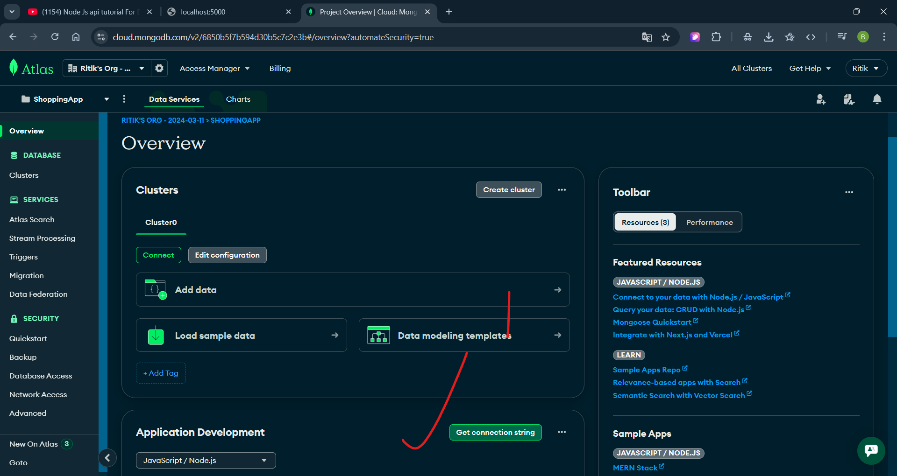
11) 

12) module=>service=>controller=>route=>access end point
13) 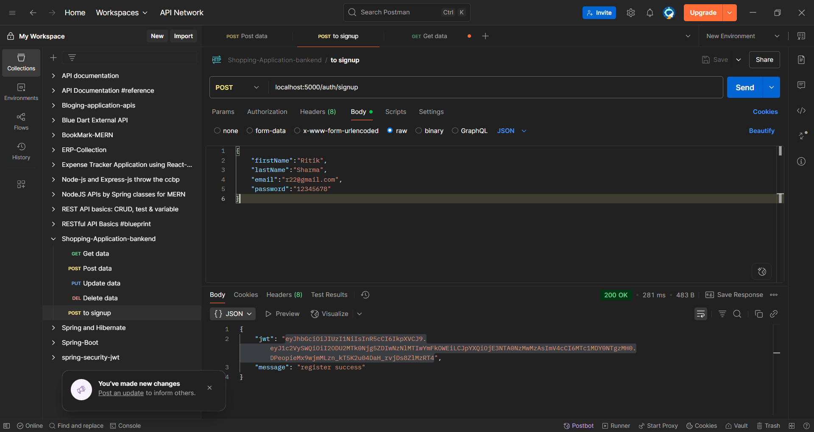
14) 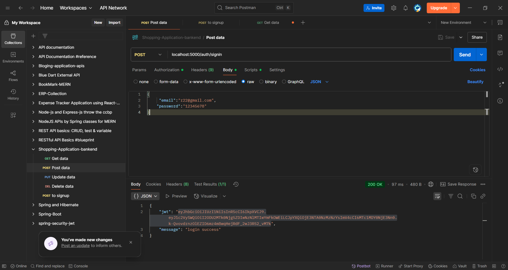
15) 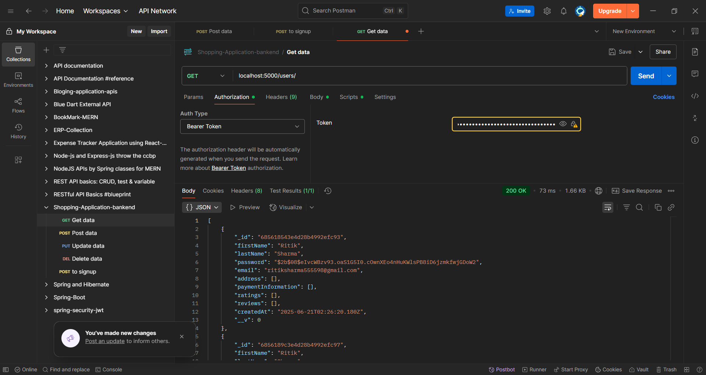

## 